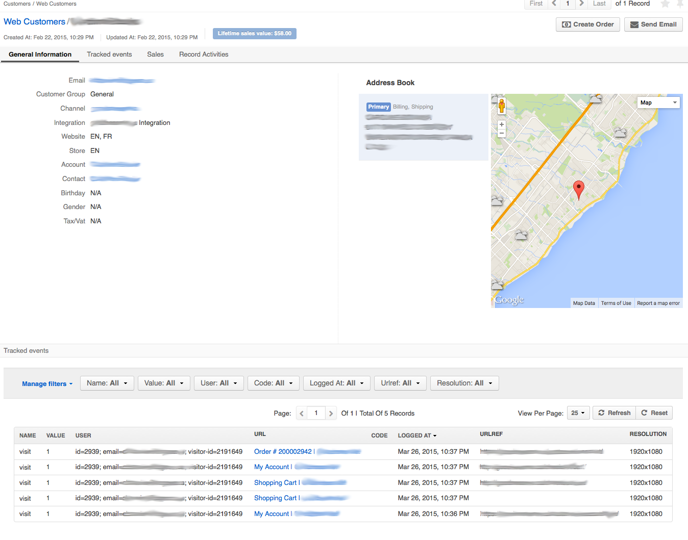

#TrackedEventsUserBundle

This bundle adds Tracked Events on WebCustomer's page in OroCRM.

#### Requirements
------------
- Requires custom fields on TrackingEvent entity: `urlref` and `res`. Both as String  

#### Screenshots
------------

#### Todo
------------
- Add migration script to create custom fields automaticaly.
