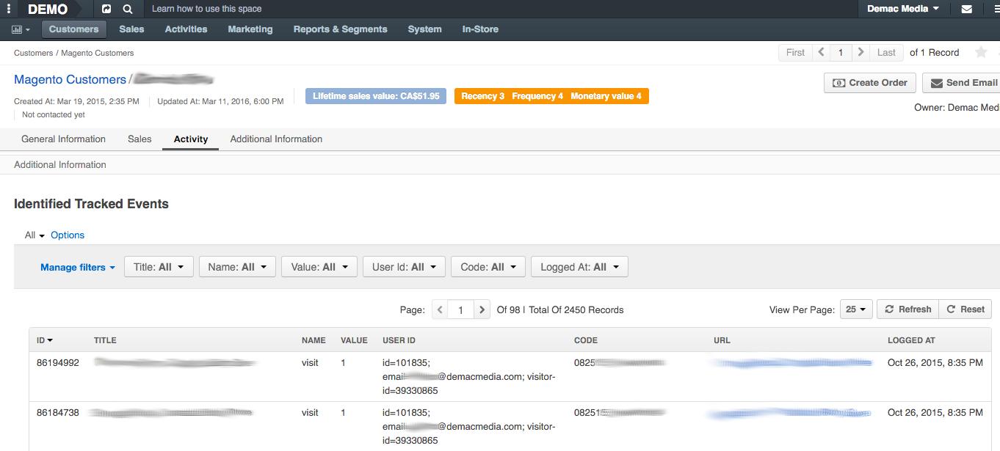

#TrackedEventsUserBundle

This bundle adds Tracked Events on WebCustomer's page in OroCRM.

#### Description:

This bundle adds tracked events from a specific user on Magento Customer
 Page. All these events comes from `oro:parse` command which automatically
 identifies magento events and linked it with their specific users.

#### Screenshot:

